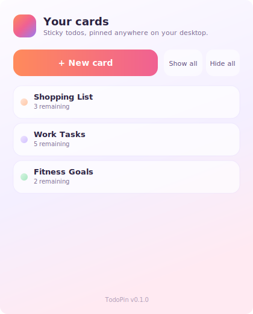
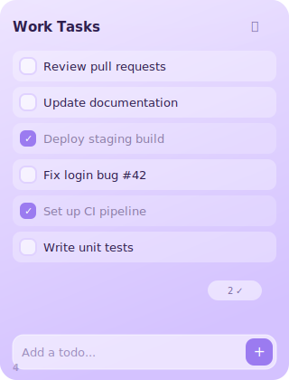
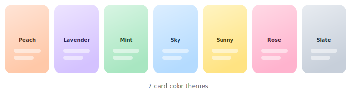

<p align="center">
  
</p>

<h1 align="center">TodoPin</h1>

<p align="center">
  <strong>Cute, pinnable todo cards for your Windows desktop.</strong>
</p>

<p align="center">
  <a href="https://github.com/bahri-hirfanoglu/win-todopin/releases"></a>
  <a href="LICENSE"></a>
  
  
</p>

---

TodoPin lets you create lightweight, frameless todo cards that float on your desktop. Pin them anywhere, customize colors, and keep your tasks always in sight. Built with [Tauri v2](https://tauri.app/), [Svelte 5](https://svelte.dev/), and Rust.

<p align="center">
  
  &nbsp;&nbsp;&nbsp;
  
</p>

## Features

- **Floating todo cards** — Frameless, draggable cards that sit on your desktop
- **Pin or widget mode** — Keep cards always on top, or let them sit behind other windows
- **7 card colors** — Peach, Lavender, Mint, Sky, Sunny, Rose, Slate
- **6 app themes** — Default, Windows, macOS, GitHub Dark, Nord, Dracula
- **Global keyboard shortcuts** — Show/hide all cards, create new cards, open manager (customizable)
- **Multi-monitor support** — Cards remember their position across monitors
- **System tray** — Runs quietly in the background with tray icon controls
- **Bilingual** — English and Turkish interface
- **Auto-start** — Optionally launch at Windows startup
- **Lightweight** — ~4 MB installer, minimal memory usage

<p align="center">
  
</p>

## Installation

### Download

Grab the latest installer from the [Releases](https://github.com/bahri-hirfanoglu/win-todopin/releases) page:

- **`TodoPin_x.x.x_x64-setup.exe`** — NSIS installer (recommended)
- **`TodoPin_x.x.x_x64_en-US.msi`** — MSI installer

### Build from source

**Prerequisites:**
- [Node.js](https://nodejs.org/) v18+
- [pnpm](https://pnpm.io/)
- [Rust](https://rustup.rs/) (stable)
- [Tauri v2 prerequisites](https://tauri.app/start/prerequisites/)

```bash
git clone https://github.com/bahri-hirfanoglu/win-todopin.git
cd win-todopin
pnpm install
pnpm tauri build
```

Installers will be in `src-tauri/target/release/bundle/`.

## Usage

### Manager Window

The manager window is your central hub for managing all cards. From here you can:

- Create new cards
- Show or hide all cards at once
- Toggle card visibility individually
- Delete cards
- Access settings

### Card Windows

Each card is its own frameless window. You can:

- **Drag** the card by its header area
- **Add todos** using the input field at the bottom
- **Check off** completed items
- **Change the card color** via the menu (⋯)
- **Pin/unpin** to toggle always-on-top mode
- **Hide** to minimize the card (reopen from manager or tray)

### Keyboard Shortcuts

All shortcuts are global (work even when TodoPin is not focused) and customizable in Settings:

| Default Shortcut | Action |
|---|---|
| `Ctrl+Shift+S` | Show all cards |
| `Ctrl+Shift+H` | Hide all cards |
| `Ctrl+Shift+N` | Create new card |
| `Ctrl+Shift+M` | Open manager window |

### App Themes

Choose an app theme from Settings to change the overall look:

| Theme | Style |
|---|---|
| Default | Soft pink/purple gradients |
| Windows | Fluent Design with blue accents |
| macOS | Clean, minimal with system blue |
| GitHub | Dark mode with green accents |
| Nord | Cool blue-gray palette |
| Dracula | Dark purple with vibrant accents |

## Tech Stack

| Layer | Technology |
|---|---|
| Backend | Rust + [Tauri v2](https://tauri.app/) |
| Frontend | [Svelte 5](https://svelte.dev/) + TypeScript |
| Bundler | [Vite](https://vitejs.dev/) |
| Styling | Vanilla CSS with CSS variables |
| Storage | JSON file (atomic writes) |
| Icons | Programmatically generated |

## Architecture

TodoPin uses a multi-window architecture:

- **Manager window** — Single instance, acts as the control panel
- **Card windows** — One per card, frameless and independently positioned
- **System tray** — Always running, provides quick access

State is managed in Rust with thread-safe locking (`parking_lot::Mutex`) and a background persistence thread that writes to disk every 500ms when changes are detected (dirty flag pattern).

## Contributing

See [CONTRIBUTING.md](CONTRIBUTING.md) for development setup and guidelines.

## License

[MIT](LICENSE)
